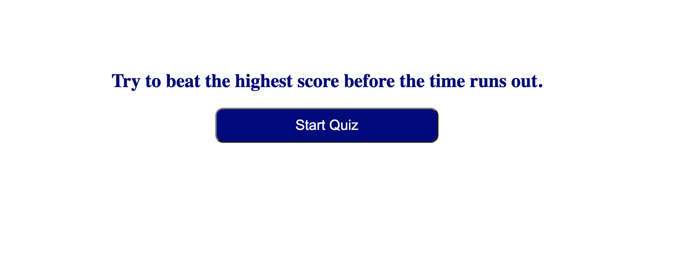
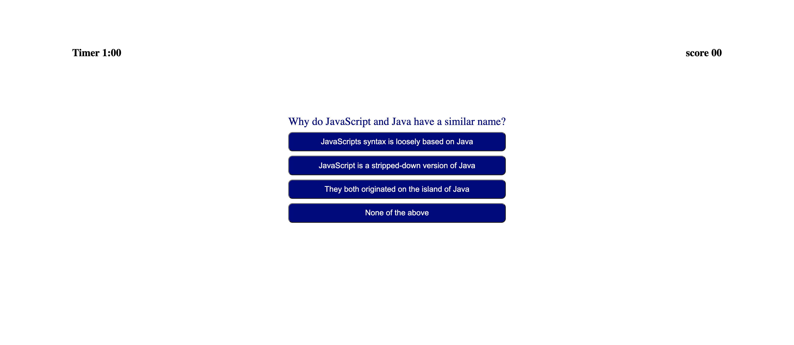

# Quiz-app

This project was designed as a homework assignment  

This application emphasizes the use of DOM to create a quiz.

This project has been deployed to GitHub Pages. To get this project up and running, you can follow the deployment link. Or, download the sources files to use this as a template.

## Getting Started

This project has been deployed to GitHub Pages. To get this project up and running, you can follow the deployment link. Or, download the sources files to use this as a template.
* [GitHub Repository] https://github.com/MahmoudAbdulrhman/Quiz-app

### This project has the following features: 
* A challnging quiz 
once you click the start button the app will take through 10 random multiple qustions.this random qustion selection happen through groub of if statment , each qustion will replace the one before it in the qustion container by using the DOM features
* A timer : you 1:00 only befor the app take you to score bored
* A highscore capture to save it in the localStorge.
  ### Screen shot
  
  

